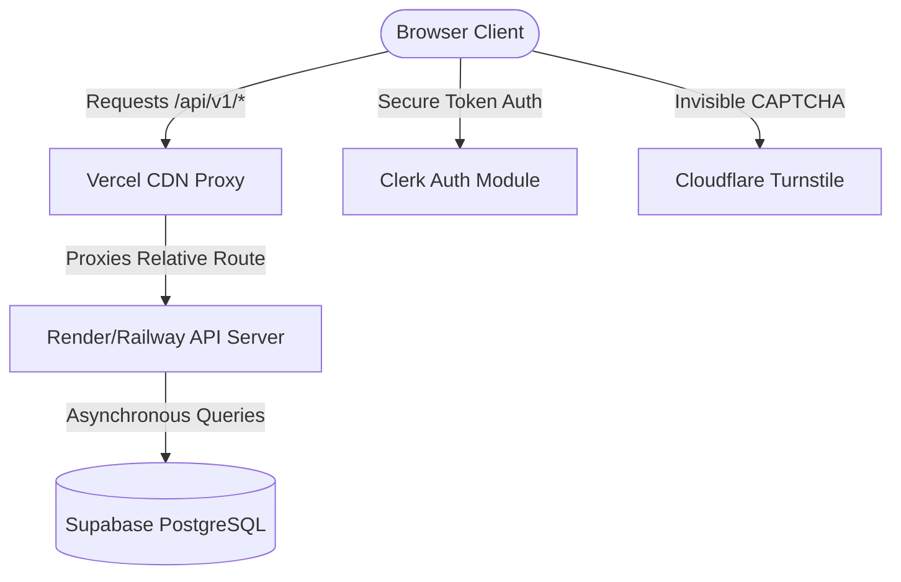

# TypeForge AI ⌨️

[](https://vercel.com)
[](https://render.com)
[](https://supabase.com)
[](https://clerk.com)
[](https://cloudflare.com)
[](LICENSE)

TypeForge AI is a premium, adaptive typing training platform. Instead of just measuring your words-per-minute (WPM), TypeForge operates as a deliberate practice coach. Powered by a python-based machine learning pipeline, it tracks typing anomalies, delays, reaction times, and key errors to generate completely unique, real-time training curriculums personalized to your exact weaknesses.

---

## 🏗️ Project Architecture

The application is built on a decoupled, production-ready stack:

- **Frontend**: High-performance, compile-less Vanilla HTML5, CSS3, and ES Module JavaScript. Styled with custom Outfit/Inter design tokens, glassmorphism, and aurora canvas overlays.
- **Backend API**: Python FastAPI providing high-speed, asynchronous request routing, JWT validation, and automated database syncing.
- **Database Layer**: Supabase PostgreSQL hosting with Row-Level Security (RLS) policies enforcing strict user-data partitioning.
- **Machine Learning**: Custom pipeline utilizing K-Means Clustering for typing archetypes, XGBoost for progress forecasting, LightGBM for curriculum item ranking, and Isolation Forests for cheat/fatigue detection.



---

## 📂 Project Structure

```
TypeForge/
├── index.html                  # Main landing page
├── features.html               # Features breakdown page
├── about.html                  # Product & team story page
├── blog.html                   # TypeForge journal
├── feedback.html               # Interactive feedback & CAPTCHA page
├── login.html                  # Clerk Auth widget landing
├── vercel.json                 # Vercel CDN routing & Proxy config
├── sitemap.xml                 # Search engine index mapping
├── robots.txt                  # Crawl indexing rules
│
├── css/
│   ├── global.css              # Typography, variables, & styling tokens
│   ├── animations.css          # Complex CSS keyframe micro-animations
│   ├── components.css          # Shareable components (Navbar, Sidebar, Buttons)
│   ├── landing.css             # Page-specific landing UI overrides
│   ├── typing.css              # Core typing interface styles
│   └── dashboard.css           # Analytics grid positioning
│
├── js/
│   ├── common.js               # Shared ESM utilities, animations, & draw tools
│   ├── api.js                  # Authenticated proxy client & API wrapper
│   ├── clerk.js                # Clerk SDK token auth management
│   └── accessibility.js        # Dyslexia-friendly settings panel
│
├── app/
│   ├── onboarding.html         # Interactive onboarding layout
│   ├── typing.html             # Core adaptive typing application
│   ├── dashboard.html          # Performance charts & stats dashboard
│   ├── history.html            # Session telemetry grid logs
│   ├── achievements.html       # Bento achievements grid & progress ring
│   └── settings.html           # Clerk user settings widget container
│
└── backend/
    ├── main.py                 # FastAPI core application runner
    ├── config.py               # Pydantic Settings env loader
    ├── database.py             # PostgreSQL async connection pool
    ├── dependencies.py         # Clerk auth and dependency middleware
    ├── schema.sql              # Database schema tables and RLS config
    ├── requirements.txt        # Production Python dependencies
    ├── .env.example            # Environment variables placeholder
    │
    ├── routers/
    │   ├── auth.py             # Cloudflare Turnstile token validation
    │   ├── users.py            # User stats & achievements database queries
    │   ├── sessions.py         # Typing sessions logger & analysis
    │   ├── analytics.py        # DNA & performance metrics compiler
    │   └── training.py         # Adaptive test scheduler
    │
    ├── models/
    │   └── models.py           # Pydantic models for type checking
    │
    ├── services/
    │   ├── adaptive.py         # Keystroke telemetry & text generator
    │   └── achievements.py     # Achievement unlocker service
    │
    └── ml/
        └── pipeline.py         # K-Means, XGBoost, and ranking algorithms
```

---

## ⚡ Quick Start (Local Development)

### 1. Run the Frontend Client
The frontend is compile-free and runs directly on static servers.
```bash
# Serve the root folder using Python's built-in server
python -m http.server 8000

# Open your browser and navigate to:
# http://localhost:8000
```

### 2. Configure & Run the Backend
The FastAPI server manages ML processing and Supabase data piping.
```bash
cd backend

# Initialize a clean virtual environment
python -m venv .venv
source .venv/bin/activate  # On Windows: .venv\Scripts\activate

# Install dependencies
pip install -r requirements.txt

# Create your local environment settings
cp .env.example .env
# Open .env and insert your Clerk, Supabase, and Turnstile secrets

# Spin up the API server locally on port 8001
python main.py
```
*API documentation is auto-generated and available at `http://localhost:8001/docs` in development.*

---

## 🔒 Security & Key Masking

In production, client-side scripts are routed through a secure **Vercel API Proxy** to ensure sensitive server configurations remain protected:

1. **Proxy Handshake**: Requests to backend servers are sent via relative routes (e.g. `/api/v1/sessions`) rather than hardcoded endpoints, masking the origin domain.
2. **Reverse Proxying**: Vercel handles the API handshake server-side using rules defined in [vercel.json](vercel.json).
3. **Environment Security**: All sensitive keys (`CLERK_SECRET_KEY`, `SUPABASE_SERVICE_KEY`, etc.) reside safely as environment variables on your Render/Railway backend hosting platform, completely inaccessible from browser inspector tools.

---

## 📄 License & Credits

© 2026 TypeForge AI. 

Designed and Developed by [rotric04](https://github.com/rotric04).
