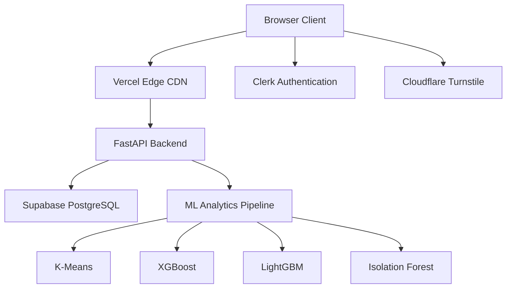

# ⌨️ TypeForge AI

<div align="center">

# TypeForge AI

### Adaptive Typing Intelligence Powered by Machine Learning

Transform typing practice into a personalized learning experience through real-time behavioral analysis, predictive analytics, and adaptive training generation.

[Live Demo](https://typeforge.fun) • [Documentation](docs/SYSTEM.md) • [Features](#features) • [Contributing](#contributing)


</div>

---

## 📚 Documentation

- 📖 [System Architecture](./docs/SYSTEM.md) — Comprehensive technical report, SWOT/TOWS analysis, and the 4+1 Architectural Views model.
- 🚀 [Getting Started Guide](#🚀-getting-started) — Setup instructions for the frontend and backend local development.

### 📁 Quick Access

| Document | Purpose | File Path |
| :--- | :--- | :--- |
| **System Architecture** | Technical Architecture, 4+1 views, SWOT | [docs/SYSTEM.md](docs/SYSTEM.md) |
| **Main Overview** | High-level features, roadmap, setup | [README.md](README.md) |

---

## 🚀 What Is TypeForge?

Most typing platforms only measure speed.

**TypeForge analyzes how you type.**

Using machine learning and keystroke telemetry, TypeForge identifies behavioral patterns, reaction delays, hesitation zones, accuracy bottlenecks, and typing weaknesses to generate personalized practice sessions that evolve with every user interaction.

Instead of repeating generic typing tests, users receive training specifically optimized for their unique typing profile.

---

## ✨ Key Features

### 🧠 Adaptive Learning Engine

* Personalized typing curriculum generation
* Dynamic difficulty adjustment
* Real-time weakness detection
* Continuous skill progression tracking

### 📊 Advanced Analytics

* WPM tracking
* Accuracy scoring
* Reaction-time analysis
* Error heatmaps
* Historical performance trends

### 🤖 Machine Learning Pipeline

* K-Means clustering for user archetypes
* XGBoost performance forecasting
* LightGBM exercise ranking
* Isolation Forest anomaly detection

### 🔒 Enterprise-Grade Security

* Clerk Authentication
* JWT validation
* PostgreSQL Row Level Security
* Cloudflare Turnstile protection
* Secure API proxy architecture

### ⚡ High Performance

* Compile-free frontend
* Lazy-loaded modules
* Passive event listeners
* Optimized rendering pipeline
* Memory leak prevention

---

# 🏗 System Architecture



---

# ⚙️ Tech Stack

| Layer            | Technologies                       |
| ---------------- | ---------------------------------- |
| Frontend         | HTML5, CSS3, JavaScript ES Modules |
| Backend          | FastAPI, Python                    |
| Database         | PostgreSQL, Supabase               |
| Authentication   | Clerk                              |
| Security         | Cloudflare Turnstile               |
| Machine Learning | Scikit-Learn, XGBoost, LightGBM    |
| Deployment       | Vercel, Render                     |
| Version Control  | Git, GitHub                        |

---

# 📈 Engineering Highlights

## Custom Performance Manager

Built a client-side performance layer that:

* Pauses off-screen animations
* Prevents telemetry memory leaks
* Optimizes mobile rendering
* Uses IntersectionObserver for resource efficiency

---

## Real-Time Typing Intelligence

Tracks:

* Key latency
* Burst speed
* Error frequency
* Recovery speed
* Character-level weaknesses

to build personalized training recommendations.

---

## Production Security Model

```text
Browser
   ↓
Vercel Proxy
   ↓
FastAPI
   ↓
Supabase
```

No database credentials or service keys are ever exposed to the client.

---

# 📂 Project Structure

```text
TypeForge/
│
├── app/                          <-- Core typing app (typing interface, dashboard, etc.)
├── backend/                      <-- FastAPI server, database schema, and routers
│   └── ml/                       <-- Keystroke dynamics and personalization models
├── css/                          <-- Global theme variables, components, and animations
├── js/                           <-- Common layout scripts, Clerk auth, onboarding tours
├── docs/                         <-- Project documentation
│   ├── README.md                 <-- General project overview
│   └── SYSTEM.md                 <-- Comprehensive technical report and system architecture
└── index.html & static files     <-- Marketing pages (about, blog, features, etc.)
```

Detailed structure and architectural details are available in the [docs/SYSTEM.md](docs/SYSTEM.md) report.

---

# 🚀 Getting Started

## Clone Repository

```bash
git clone https://github.com/rotric04/TypeForge.git

cd TypeForge
```

---

## Frontend

```bash
python -m http.server 8000
```

Visit:

```text
http://localhost:8000
```

---

## Backend

```bash
cd backend

python -m venv .venv

source .venv/bin/activate

pip install -r requirements.txt
```

Create:

```env
CLERK_SECRET_KEY=
SUPABASE_URL=
SUPABASE_SERVICE_KEY=
TURNSTILE_SECRET_KEY=
```

Run:

```bash
python main.py
```

API Docs:

```text
http://localhost:8001/docs
```

---

# 📊 Roadmap

* [x] Adaptive typing engine
* [x] User authentication
* [x] Analytics dashboard
* [x] Achievement system
* [x] ML personalization
* [ ] Real-time multiplayer races
* [ ] AI-generated typing lessons
* [ ] Typing coach assistant
* [ ] Mobile application
* [ ] Browser extension

---

# 🤝 Contributing

Contributions are welcome.

Whether you're interested in:

* UI/UX improvements
* Backend optimization
* Machine learning research
* Documentation
* Testing

Feel free to fork the repository and submit a pull request.

```bash
git checkout -b feature/amazing-feature
git commit -m "Add amazing feature"
git push origin feature/amazing-feature
```

---

# 🌟 Support The Project

If you find TypeForge useful:

⭐ Star the repository

🍴 Fork the project

🛠 Contribute improvements

📢 Share it with others

Every star helps increase visibility and encourages future development.

---

# 👨‍💻 About The Developer

## Mohit Assudani

Software Engineer focused on:

* Machine Learning
* High-Performance Web Systems
* Full-Stack Engineering
* Human-Computer Interaction

### Connect

GitHub: https://github.com/rotric04

LinkedIn: https://linkedin.com/in/mohit-assudani-

Email: [mohitassudani.3@gmail.com](mailto:mohitassudani.3@gmail.com)

---

## License

Released under the MIT License.

Built with curiosity, engineering discipline, and a passion for creating better learning experiences.
