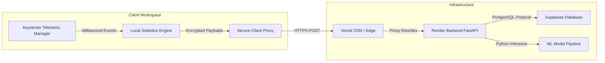
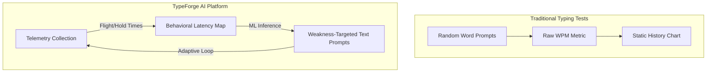
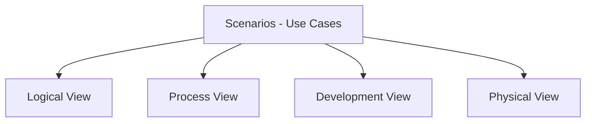
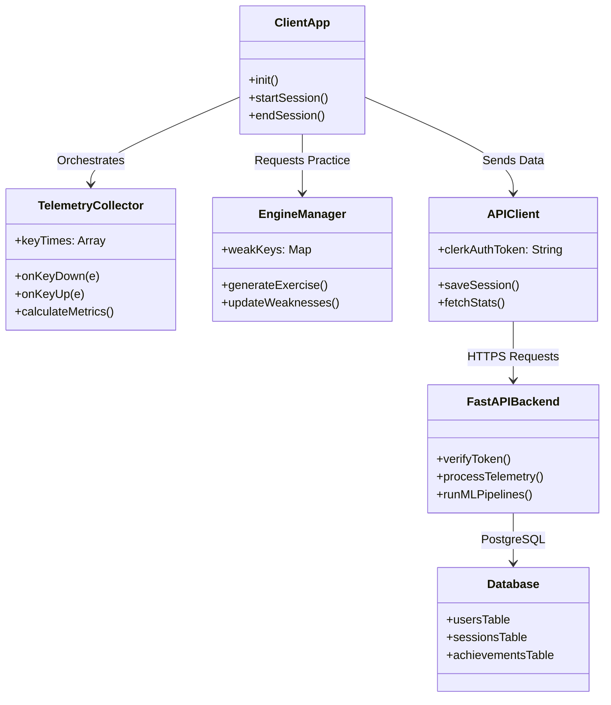
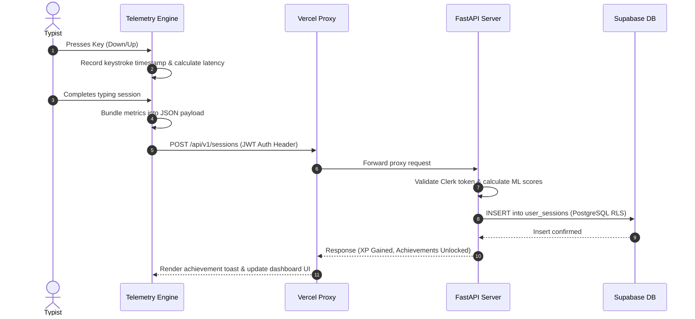
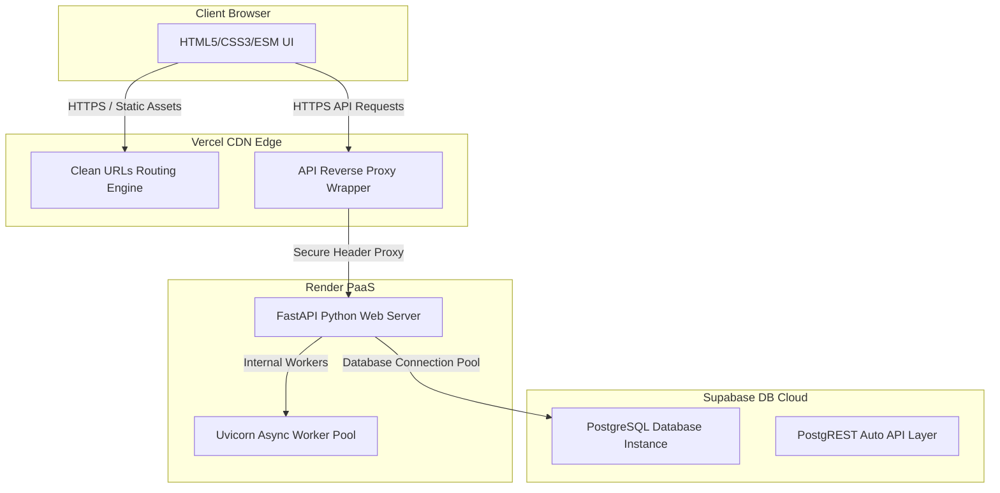

# TypeForge AI: Comprehensive Technical Report, SWOT/TOWS Analysis, and 4+1 Architectural Views Model

TypeForge AI represents a paradigm shift in human-keyboard interfaces—transitioning typing education from passive, static test platforms to an active, telemetry-driven, adaptive machine learning environment.

---

## 1. System Scope & Technical Overview

TypeForge AI is designed as a secure, high-performance, compile-free web application. Its goal is to analyze keystroke dynamics in real-time, generate custom practice exercises, and securely store historical progress.

### Technical Scope Boundaries


*   **Keystroke Telemetry collection**: Running entirely on the client-side to capture key-down, key-up, flight-time, and hold-time events at millisecond precision.
*   **Adaptive Practice Engine**: Algorithms that intake user latency maps and generate exercises to improve weak key transitions.
*   **Secure API Architecture**: A reverse-proxy system routing authenticated requests from the browser to the backend without exposing database keys.
*   **Machine Learning Models**: Client-side heuristics combined with server-side batch analysis (K-Means, XGBoost) to classify typing archetypes.

---

## 2. Target Audience Segments

TypeForge AI serves a diverse user base, categorizable into distinct personas:

| Audience Segment | Primary Pain Point | TypeForge Value Proposition |
| :--- | :--- | :--- |
| **Software Engineers** | Typos in syntax, slow bracket/brace transitions, shift key fatigue. | Code-specific tests in 10 languages focusing on symbols and variables. |
| **Data Entry Professionals** | Muscle strain, low long-term WPM accuracy, high error overhead. | Real-time rhythm mapping, posture guidance, and error hot-spot analysis. |
| **Students & Academics** | Hunt-and-peck writing, cognitive context switching during typing. | Onboarding paths that guide them to touch typing without looking down. |
| **Typing Enthusiasts** | Speed plateaus (stuck at 80 WPM), layout transitions (QWERTY to Colemak). | Telemetry analysis of weak character pairs and layout fatigue curves. |

---

## 3. How TypeForge Differs From Existing Platforms

Traditional typing tests (e.g., Monkeytype, 10FastFingers) act as **assessment tools**—measuring speed and accuracy. TypeForge is a **learning platform**—analyzing typing habits to help you improve.



### Unique Selling Points (USPs)
*   **Keystroke Flight & Hold Telemetry**: Captures the exact millisecond delays between letters, not just overall words per minute.
*   **Personalized Typing DNA**: Creates a visual map of your keyboard weaknesses, finger biases, and fatigue curves.
*   **Developer-First Focus**: Specialized coding practices that train your muscles to type programming syntax, brackets, and operators efficiently.
*   **Dynamic Lesson Generation**: Adapts exercises to target the keys you struggle with in real-time, helping you break through plateaus.

---

## 4. Pros & Cons Analysis

### Technical Audience Perspective
> [!NOTE]
> Tailored for developers, engineers, and ML contributors looking at the codebase.

| Pros (Advantages) | Cons (Limitations) |
| :--- | :--- |
| **Compile-Free Frontend**: Pure JavaScript ES Modules; no complex bundlers or build steps. | **Python Cold Starts**: Render backend on free tier can experience cold start delays. |
| **Client-Side Telemetry**: Telemetry capture runs in the browser, avoiding database overload. | **No Offline Mode**: Requires an active internet connection to sync stats and authenticate with Clerk. |
| **Secure API Wrapper**: PostgreSQL RLS combined with backend validation prevents key exposure. | **Browser Loop Latency**: Heavier JavaScript telemetry loops could cause page stutter on very old hardware. |

### Non-Technical User Perspective
> [!NOTE]
> Tailored for professionals, students, and general typists.

| Pros (Advantages) | Cons (Limitations) |
| :--- | :--- |
| **Personalized Training**: No more typing the same generic paragraphs; the app adapts to you. | **Learning Curve**: Transitioning to touch typing can temporarily reduce your speed. |
| **Visual Telemetry**: Visual representations like heatmaps make it easy to understand weaknesses. | **Mobile Limitations**: Real-time physical keyboard typing is not optimized on mobile web browsers. |
| **Gamified Progress**: XP levels, badges, and achievements keep practice engaging. | **No Custom Text Uploads**: Currently unable to copy-paste custom paragraphs for practice. |

---

## 5. SWOT & TOWS Strategic Matrix

### SWOT Analysis

```
                      STRENGTHS (+)                                  WEAKNESSES (-)
          ┌──────────────────────────────────────────────┬──────────────────────────────────────────────┐
          │ • Keystroke telemetry tracking               │ • Dependency on backend for data analysis.   │
          │ • Adaptive practice loops.                   │ • Lacks steno or non-traditional layout guides│
   INTERNAL │ • Zero-compile, high-performance frontend.   │ • Mobile browser typing is not yet optimized.│
          │ • Secure architecture (Clerk, Supabase RLS). │ • Limited multiplayer features.              │
          └──────────────────────────────────────────────┴──────────────────────────────────────────────┘
                      OPPORTUNITIES (+)                                 THREATS (-)
          ┌──────────────────────────────────────────────┬──────────────────────────────────────────────┐
          │ • Integration into developer tools.          │ • Established platforms adding telemetry.    │
   EXTERNAL │ • B2B enterprise typing training plans.      │ • Web browser restrictions on telemetry.     │
          │ • Steno and alternative keyboard support.    │ • Changes to free hosting tier limits.       │
          │ • Mobile applications with layout analysis.  │ • Security vulnerabilities in dependencies.  │
          └──────────────────────────────────────────────┴──────────────────────────────────────────────┘
```

### TOWS Strategic Matrix
Derived from our SWOT analysis, the TOWS matrix identifies strategic actions:

| TOWS | Strengths (S) | Weaknesses (W) |
| --- | --- | --- |
| **Opportunities (O)** | **SO Strategy**: Use the client-side telemetry to build developer tool plugins (e.g., VS Code extension) to capture real-world coding telemetry. | **WO Strategy**: Build a local database fallback (IndexedDB) to allow offline practice, reducing backend dependency. |
| **Threats (T)** | **ST Strategy**: Patent or open-source the telemetry heuristics engine to establish TypeForge as the standard for typing analysis. | **WT Strategy**: Optimize the client-side code to reduce hosting costs and ensure compatibility with privacy-focused browsers. |

---

## 6. The 4+1 Architectural Views Model

We use the Philippe Kruchten **4+1 Architectural Views Model** to document the TypeForge AI system architecture.



---

### 1. Logical View (Component Relationships)
The logical view describes the object-oriented design and components of the system.



---

### 2. Process View (System Workflows)
The process view shows how runtime processes communicate, focusing on the real-time typing loop.



---

### 3. Development View (Code Organization)
The development view shows how the codebase is organized, including key files and folders:

```text
TypeForge/
│
├── index.html                    <-- Marketing landing page
├── about.html                    <-- Mission, story, team page
├── features.html                 <-- Detailed feature breakdown
├── blog.html                     <-- Blog index listing articles
├── sitemap.xml                   <-- Public search engine sitemap
├── robots.txt                    <-- Search engine index rules
│
├── js/
│   ├── common.js                 <-- Shared navbar, drawer, analytics scripts
│   ├── clerk.js                  <-- Clerk authentication layer
│   ├── tour.js                   <-- Onboarding tour guides
│   └── accessibility.js          <-- Contrast, font controls, screen reader support
│
├── css/
│   ├── global.css                <-- Base theme variables (colors, typography)
│   ├── components.css            <-- Buttons, cards, modals, toast styles
│   └── landing.css               <-- Marketing page animations and layout
│
├── app/
│   ├── typing.html               <-- The core typing practice application
│   ├── dashboard.html            <-- User analytics dashboard
│   ├── history.html              <-- User typing history logs
│   ├── achievements.html         <-- Badges & XP levels tracking
│   └── settings.html             <-- User profile management
│
└── backend/
    ├── main.py                   <-- FastAPI main server entrypoint
    ├── config.py                 <-- CORS settings and API environment keys
    ├── schema.sql                <-- Supabase database schema
    └── routers/                  <-- API endpoints (analytics, achievements)
```

---

### 4. Physical View (Deployment Infrastructure)
The physical view shows the hardware and hosting environments used to deploy the system.



---

### 5. Scenario View (+1 / Use Cases)
Scenarios describe the user interactions that drive the other architectural views.

#### Scenario: The Onboarding Flow
1. A new user visits `https://www.typeforge.fun`.
2. The user signs in using Clerk Authentication.
3. The onboarding page (`/app/onboarding.html`) displays, guiding the user to choose their typing goals.
4. The tour manager script (`/js/tour.js`) launches, showing the user the layout of the typing arena.
5. The first typing session initializes, recording baseline metrics for the user's profile.

---

## 7. Future Roadmap

Our development plan includes several key milestones:

*   **Real-time Multiplayer races**: Allow users to race against each other in real-time lobbies, testing their speed under competitive pressure.
*   **AI-Generated Typing Lessons**: Use machine learning to generate personalized sentences that target your exact weaknesses.
*   **Typing Coach Assistant**: An AI assistant that provides periodic tips, progress updates, and posture guidance.
*   **Browser Extension**: A Chrome/Firefox extension that tracks your typing speed and accuracy across all websites, offering real-world insights.

---

## 8. Open Source Collaboration & Bug Bounty

TypeForge AI is an open-source project, and we welcome contributions from the community. Whether you're a developer, designer, writer, or enthusiast, there are many ways to get involved:

> [!TIP]
> **How to Collaborate**
> 1. **Fork the Repository**: Clone the project to your local machine: [TypeForge Repository](https://github.com/rotric04/TypeForge).
> 2. **Report Issues**: If you find a bug or have a feature request, please open an issue on GitHub.
> 3. **Submit Pull Requests**: We review and merge community contributions regularly.
> 4. **Connect with Mohit**: Have questions or want to collaborate? Connect on [LinkedIn](https://linkedin.com/in/mohit-assudani-) or reach out via email.

Let's build the future of keyboarding together! ⌨️
