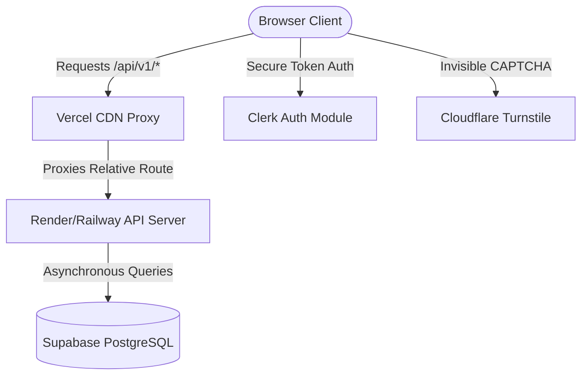

# Hi there, I'm Mohit Assudani (rotric04) 👋

I am a **Software Engineer** specializing in high-performance web systems, interactive client-side experiences, and machine-learning-driven applications. I build products that are visually stunning, mathematically backed, and architected for scale.

---

## 🛠️ Tech Stack & Skills

- **Languages**: JavaScript (ES6+), Python, SQL, HTML5, CSS3, Bash
- **Backend**: FastAPI, Node.js, Express, REST APIs, WebSocket, JWT Auth
- **Frontend**: ES Module JS, Vanilla CSS Custom Properties, Glassmorphism, Micro-Animations, anime.js
- **Database & Services**: Supabase (PostgreSQL), Clerk Authentication, Redis, Cloudflare Turnstile & Web Analytics
- **Machine Learning**: K-Means Clustering, XGBoost, LightGBM, Isolation Forests, Scikit-Learn
- **Tooling & Hosting**: Git, GitHub Actions, Vercel, Render, Railway, Vite, npm

---

## 🚀 Flagship Project: TypeForge AI ⌨️

**TypeForge AI** is a premium, adaptive deliberate-practice typing coach. Instead of just testing how fast you type, it analyzes your typing biology to build custom training curriculums designed to target your specific weaknesses.

* 🌐 **Live Website**: [https://typeforge.fun](https://typeforge.fun)
* 🐙 **GitHub Repository**: [TypeForge AI on GitHub](https://github.com/rotric04/TypeForge)

### 🏗️ Decoupled Architecture

### 🧠 Core Engineering Achievements in TypeForge

1. **Browser Resource Optimization**: Implemented a custom client-side `PerformanceManager` that handles memory leak prevention (idle garbage collection of telemetry arrays), passive scroll listeners for zero-lag mobile rendering, and off-screen animation pausing via `IntersectionObserver`.
2. **ML Practice Customization**: Developed a multi-tiered python analytics and curriculum-generation pipeline using **K-Means** to classify user archetypes, **XGBoost/LightGBM** to predict performance trends and rank exercises, and **Isolation Forests** for real-time fatigue/cheat detection.
3. **Database Telemetry & Live Sync**: Designed asynchronous FastAPI endpoints to count, average, and stream real-time database stats (active typists and keystrokes analyzed) directly from Supabase PostgreSQL to the landing pages.

---

## 📈 GitHub Stats

  
  

---

## 📬 Let's Connect!

- **LinkedIn**: [Mohit Assudani on LinkedIn](https://www.linkedin.com/in/mohitassudani/) *(Update with your actual URL)*
- **Email**: [mohitassudani.3@gmail.com](mailto:mohitassudani.3@gmail.com)
- **Portfolio**: [https://typeforge.fun](https://typeforge.fun)
- **GitHub**: [github.com/rotric04](https://github.com/rotric04)
